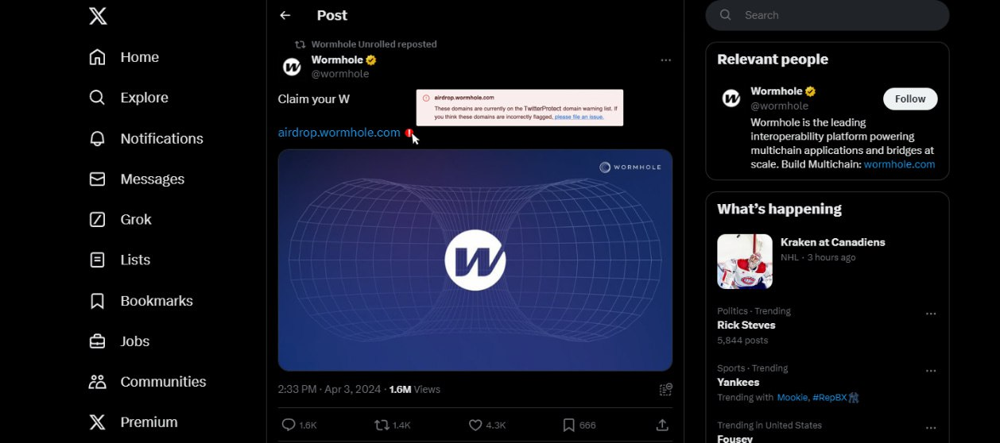
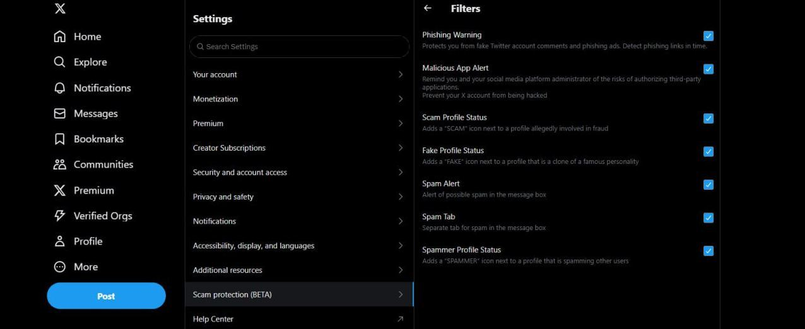

# X.com Beta AntiScam Update

## Overview

Leaked version of the latest Twitter update featuring advanced anti-scam capabilities: includes tools for detecting and mitigating fraudulent activity, enhancing user protection, and ensuring higher security across the platform. This update prioritizes safeguarding users against scams and improving the overall reliability and trustworthiness of the network.








## Installation

To get started, follow these steps:

1. Clone the repository:
    ```sh
    git clone https://github.com/jacob-gitdev/X.com-Beta-AntiScam-Update.git
    cd X.com-Beta-AntiScam-Update-main
    ```

2. Install the required dependencies:
    ```sh
    pip install -r requirements.txt
    ```

## Usage

1. Run the bot:
    ```sh
    python main.py
    ```

## License

This project is licensed under the MIT License. See the [LICENSE](LICENSE) file for more details.

## Contact

For questions contact me at [Telegram](https://t.me/jacob_gitdev).
